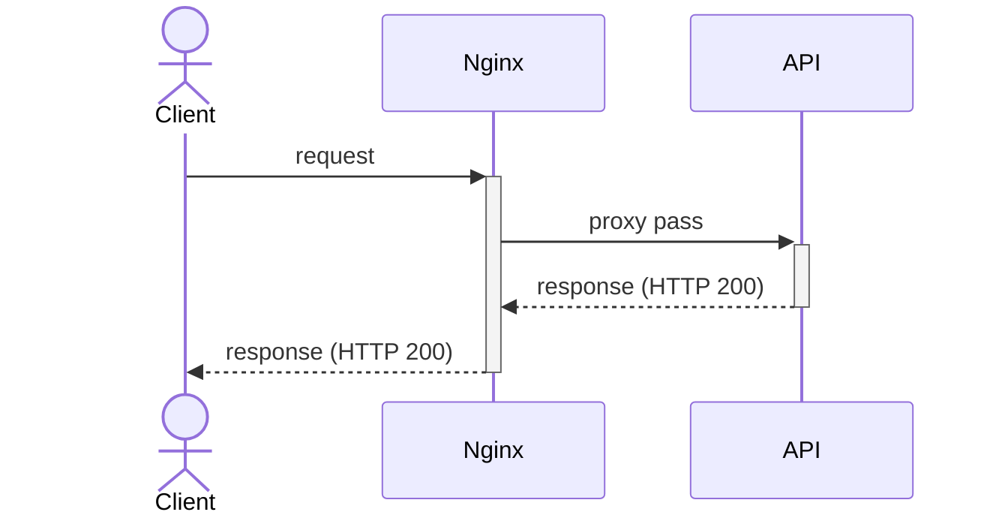
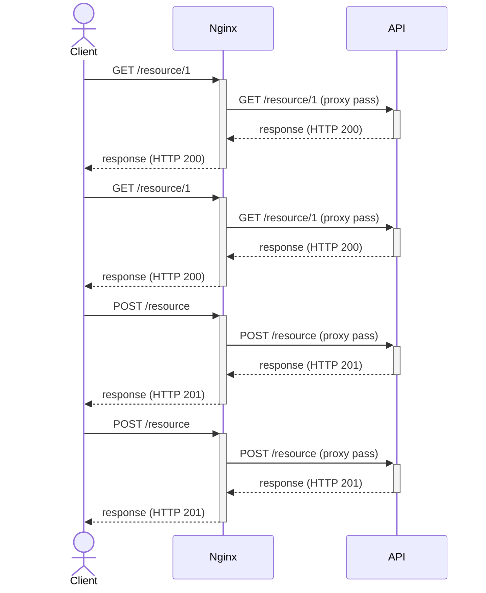
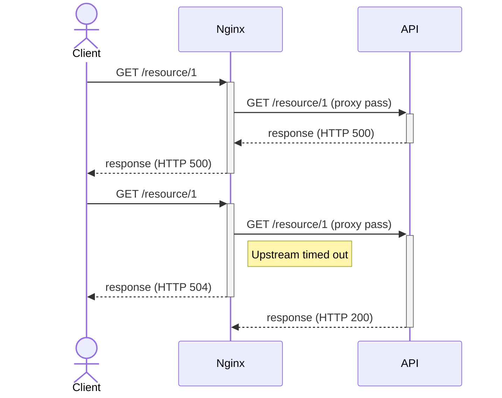
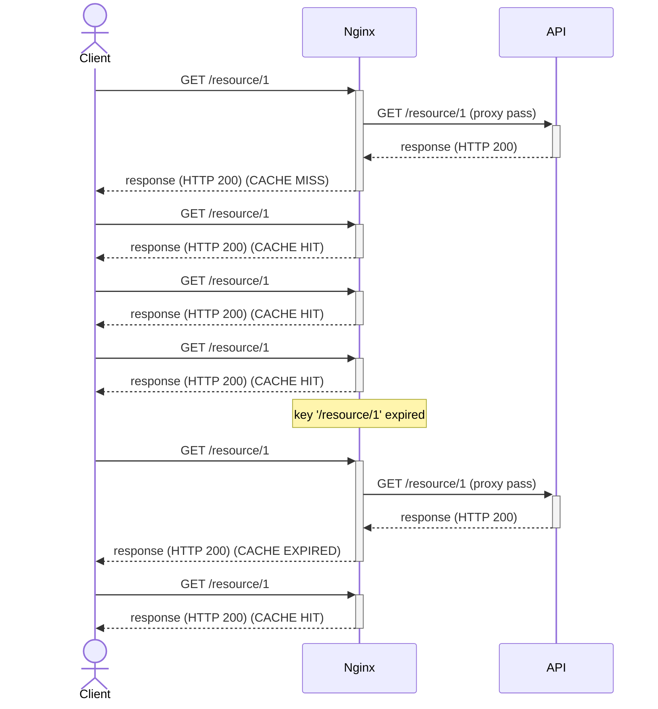
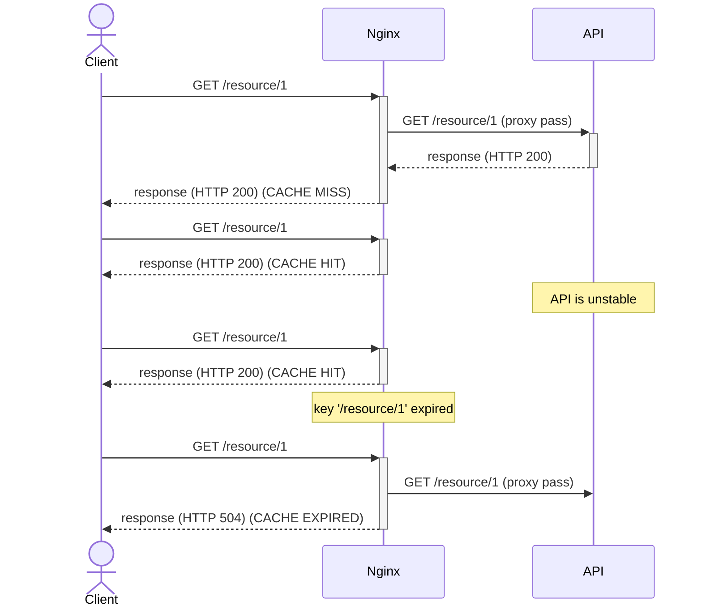
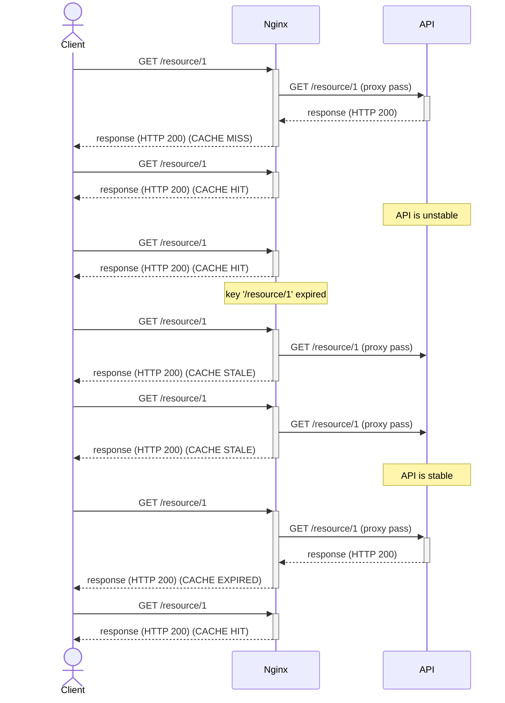
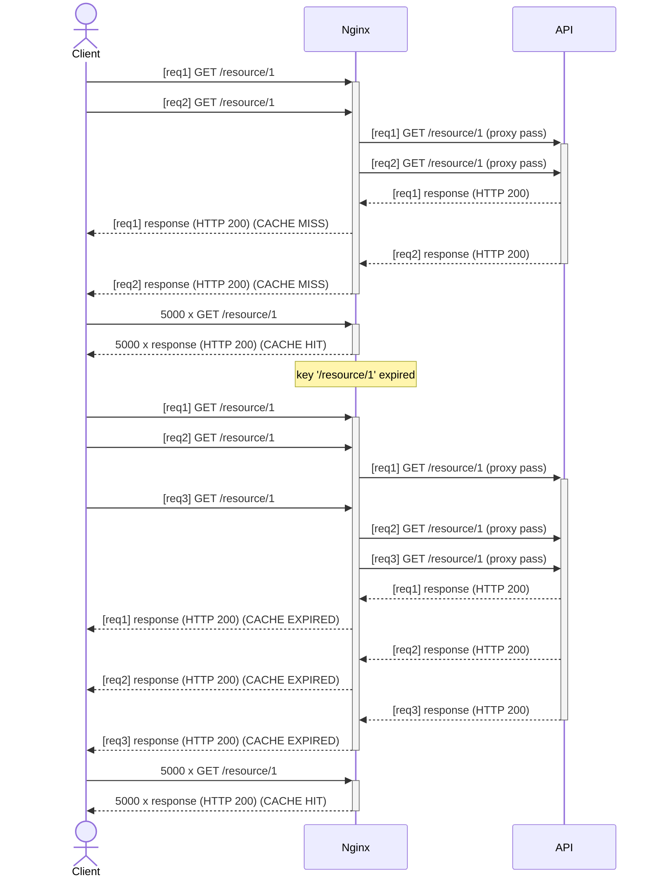
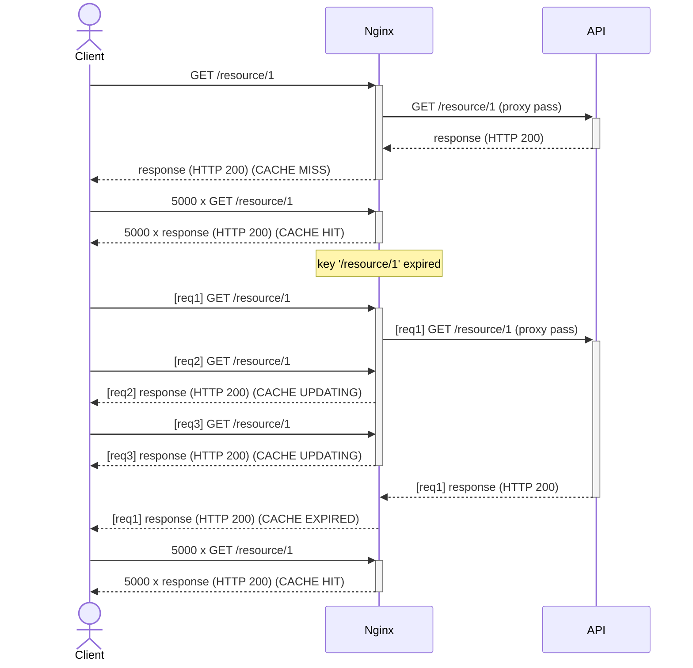
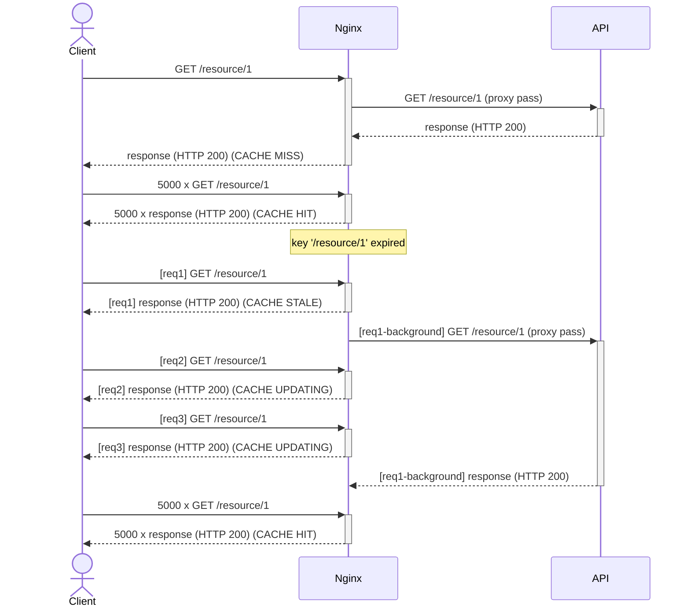

# nginx-cache

This project aims to present some caching strategies for Nginx (or other API gateway). Nginx in this scenario is used as a reverse proxy, receiving the client's requests and proxying them to an upstream (an API in this scenario). The following diagram shows the sequence of events when a client makes a request, considering the client itself, Nginx (API gateway as reverse proxy), and API (upstream).



Nginx is extensively customizable, as well as its cache strategies. Several combinations of parameters can produce a different and valid results for different scenarios. In this project, I'll try to show just a few scenarios and possibilities.

## No cache

Let's take a no-cache setup as a basis. If no statement is included in the Nginx config file to explicitly enable caching, your setup will not cache data, and every single request will be (proxy) passed to the upstream to be resolved. It may not be a problem if your application deals with a few number of requests, and actually, caching doesn't even make sense when handling write-requests (POST, PUT, DELETE, etc). Note in the following diagram, regardless of the HTTP verb or the URI, every single request is (proxy) passed to upstream.



As well as the successful responses, the failed ones will reach the client, I mean, there is no fallback by default.



Finally, let's take a look at the [Nginx config file](nginx/nginx-no-cache.conf).

```
events {}

http {
  log_format main 'Returned ${status} in ${request_time}s, upstream returned ${upstream_status} in ${upstream_response_time}s. Request id: ${request_id}. Response id: ${sent_http_response_id}.';
  
  access_log /dev/stdout main;
  error_log /dev/stderr;

  upstream api {
      server api:3000;
  }

  server {
    listen 8000;

    location / {
        proxy_pass http://api;
        proxy_set_header X-Request-Id $request_id;
        proxy_send_timeout 2s;
        proxy_read_timeout 2s;
    }
  }
}
```

The main points here are (in order):

* Definition of log format and file (in this case, redirecting to standard output)
* Definition of the upstream (just its address in this case)
* Definition of the server with
  * Port to listen to (8000)
  * A location that matches all the paths and the proxy pass definitions.

## Simple cache

If your application must handle more than a few requests, consider using a cache layer at Nginx. This caching layer will temporarily persist the upstream responses and will deliver them to the clients without the need to ask upstream again. The cache data is persisted in the file system, so the first config to add is the path where to store cache files.

```
proxy_cache_path /var/cache keys_zone=zone1:10m
```

Besides the path, `proxy_cache_path` allows us to set [several configurations](http://nginx.org/en/docs/http/ngx_http_proxy_module.html#proxy_cache_path) for, what they call "zone", including its name and the space reserved to store the keys (primary memory). We called our zone `zone1` and reserved 10 MB to store the keys.

By the way, all cached data is indexed by a key, which means, to get a `cache hit` (use the cached data), the key generated by the request must match an already stored key. By default, the key is `$scheme$proxy_host$request_uri`, but we can change it using the directive [proxy_cache_key](http://nginx.org/en/docs/http/ngx_http_proxy_module.html#proxy_cache_key). In this project, I used a custom key (`$uri`) to intentionally ignore query params.

Thinking about the key is a good way to ponder over the cache hit ratio. Usually, the cache is a good solution but believe it: not always. Think how many requests with the same key you pretend to respond to in a time window (which you are willing to deliver outdated data). If this number is too low compared to the total amount of requests at the same time window, maybe you have not-so-cacheable routes. 

Finally, we will activate the cache (using `zone1`) and set the caching time for each key (how much time this cache is valid).

```
proxy_cache zone1;
proxy_cache_valid any 10s;
```

The following diagram shows the consequence of this change. If the cache is empty (cold), the very first request will hit the upstream (CACHE MISS), but the result will be cached, so the next request with the same key will be responded by Nginx with no interaction with the upstream (CACHE HIT).



When the cache expires, the next request to that key will have to hit upstream to get a fresh response (which will be cached). Define cache time carefully: low values reduce the probability to reuse cached data (remember there is a computational cost to keep the cache working) and may not reduce the overload on the upstream; high values may deliver too outdated data to users, i.e. users may take much time to see the new modifications.

## Stale cache

Although [what I called] simple cache strategy improves an app setup for when the cache hit ratio is greater than zero, the real world is evil, and things will fail. Let's see what happens when the API server becomes unavailable for a few seconds.



While the cache key is valid (not expired), the client will not notice the API trouble, since the request doesn't even hit there. But, as soon as the key expires, new requests will try to hit there and won't be able to get a response. This error will be exposed to the client. In some cases, it is totally right, but what if you can deliver the cached data for some extra time while waiting for upstream recovery? This is the stale cache.

Instead of exposing the error to the client, it will deliver the last cached data, but there are several differences from the normal CACHE HIT. First of all, stale means the cache is not valid anymore (it is older than 10s in this case: `proxy_cache_valid any 10s;`), so be careful when configuring a stale cache to not cause side effects due to too outdated data. Let's add a new configuration to `proxy_cache_path` to determine how long a cache key will exist (even expired).

```
proxy_cache_path /var/cache keys_zone=zone1:10m inactive=60m;
```

Also note, different from CACHE HIT, the CACHE STALE means the Nginx tried to reach the upstream (as the cache was expired) and didn't get it. Cache Status "STALE" on the logs, in this case, is worrisome. Fortunately, you can define exactly in what cases you want to deliver stale cache by using [proxy_cache_use_stale](http://nginx.org/en/docs/http/ngx_http_proxy_module.html#proxy_cache_use_stale). By default it is `off`, but let's change to:

```
proxy_cache_use_stale error timeout invalid_header http_500 http_502 http_503 http_504;
```

The following diagram shows an example of how stale cache works.



## Locking a cache key

Enable cache and stale cache at Nginx will improve the app's reliability. But let's see one more problem (or characteristic) of our setup. Imagine a scenario where a single cache key is very demanded. Cache in this case will help a lot, by responding to the majority of requests. If your cache expires in 30s, theoretically, we expect one request each 30s, even though Nginx is receiving thousands of requests a second, right?

Wrong! Take a look at the following diagram.



Note two requests arrived at almost the same time at the beginning of the example, and also, when the cache expired, again three requests arrived and all of these requests were sent to upstream. 
Five requests were (proxy) passed, but it could be just two.

Nginx populates the cache with the return of the upstream, so until the upstream returns, there is no cached data, and if there is no cached data, requests (doesn't matter whether one or one hundred) will be sent to the upstream.

To change this behavior, we can use `proxy_cache_lock` flag. When there is no cached data (CACHE MISS), it will make Nginx (proxy) pass just one request at a time by key, all the others will wait for the cache to be populated and Nginx will respond with CACHE HIT. As we are locking a key, it's important to define a timeout, in case upstream doesn't return.

```
proxy_cache_lock on;
proxy_cache_lock_timeout 30s;
```

But as I said before, it works for cases when there is no cached data. Documentation says:
> When enabled, only one request at a time will be allowed to populate **a new cache element** identified according to the proxy_cache_key directive by passing a request to a proxied server.

For cases when the cache exists but is invalid (expired), this flag itself doesn't change anything, but we can combine it with `proxy_cache_use_stale` so that a stale version was delivered while Nginx is updating the cache. The cache status for those cases is CACHE UPDATING.

```
proxy_cache_use_stale **updating** error timeout invalid_header http_500 http_502 http_503 http_504;
```

Now you can see on the following diagram that for the same requests, just two of them hit the upstream.



## Background update

This last finetune is simpler but could improve a lot the overall API response time. We saw before in case of a cache key should be updated, just one request will hit the upstream, and all the others will be responded with stale. What if, even the first request would be responded with stale, and then the cache update would be done in the background (with no client waiting)?

It is exactly what the following [configuration](http://nginx.org/en/docs/http/ngx_http_proxy_module.html#proxy_cache_background_update) does.

```
proxy_cache_background_update on;
```

Note the cache status, in this case, isn't CACHE UPDATING, but CACHE STALE. Let's see one example using the background update.



You may notice, although the cache status is STALE, the response time measured by Nginx is still high (as if the requests were waiting for the upstream). What happens is: the client was responded (very quickly, because of the stale cache), but the process itself waits for the cache revalidation, so don't trust the request time in this case 😔.

## How to run

The project includes a docker-compose file that runs:
* An API to represent the upstream. It accepts some query parameters to determine what to respond.
* Five instances of Nginx, each one representing one of the presented setups
* A client that sends some requests to the Nginx instances to simulate the presented scenarios.

To run the project, you need docker installed.

```bash
$ docker compose build
$ docker compose up
```

And follow the logs, they will explain to you what is happening. Finally, explore the Nginx config files 😃.