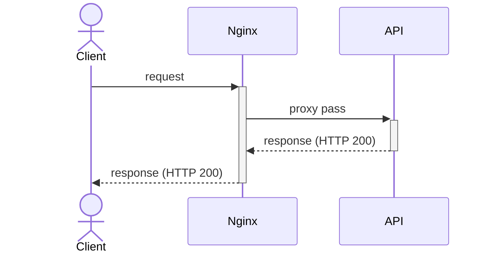
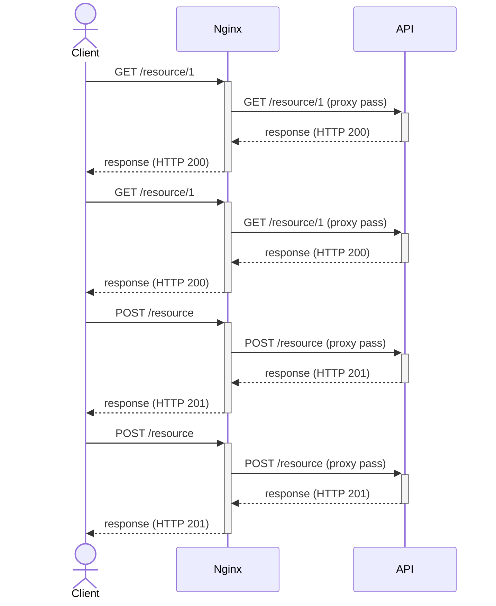
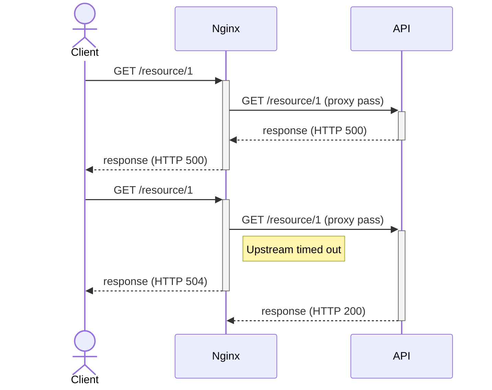

# nginx-cache

This project aims to present some caching strategies for Nginx (or other API gateway). Nginx in this scenario is used as a reverse proxy, receiving the client's requests and proxying them to an upstream (an API in this scenario). The following diagram shows the sequence of events when a client makes a request, considering the client itself, Nginx (API gateway as reverse proxy), and API (upstream).



## No cache

Let's take a no-cache setup as a basis. If no statement is included in the Nginx config file to explicitly enable caching, your setup will not cache data, and every single request will be (proxy) passed to the upstream to be resolved. It may not be a problem if your application deals with a few number of requests, and actually, caching doesn't even make sense when handling write-requests (POST, PUT, DELETE, etc). Note in the following diagram, regardless of the HTTP verb or the URI, every single request is (proxy) passed to upstream.



As well as the successful responses, the failed ones will reach the client, I mean, there is no fallback by default.



Finally, let's take a look at the [Nginx config file](nginx/nginx-no-cache.conf).

```
events {}

http {
  log_format main 'Returned ${status} in ${request_time}s, upstream returned ${upstream_status} in ${upstream_response_time}s. Request id: ${request_id}. Response id: ${sent_http_response_id}.';
  
  access_log /dev/stdout main;
  error_log /dev/stderr;

  upstream api {
      server api:3000;
  }

  server {
    listen 8000;

    location / {
        proxy_pass http://api;
        proxy_set_header X-Request-Id $request_id;
        proxy_send_timeout 2s;
        proxy_read_timeout 2s;
    }
  }
}
```

The main points here are (in order):

* Definition of log format and file (in this case, redirecting to standard output)
* Definition of the upstream (just its address in this case)
* Definition of the server with
  * Port to listen to (8000)
  * A location that matches all the paths and the proxy pass definitions.
