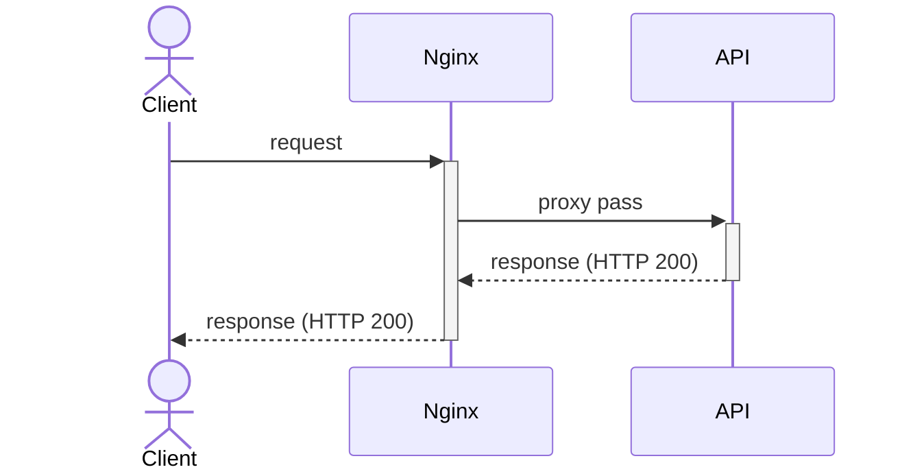
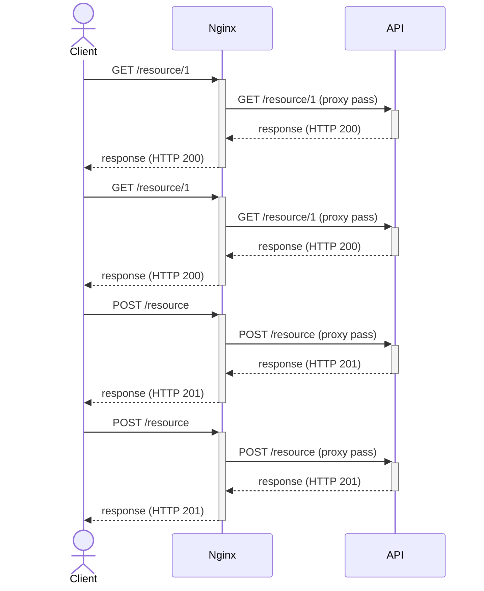
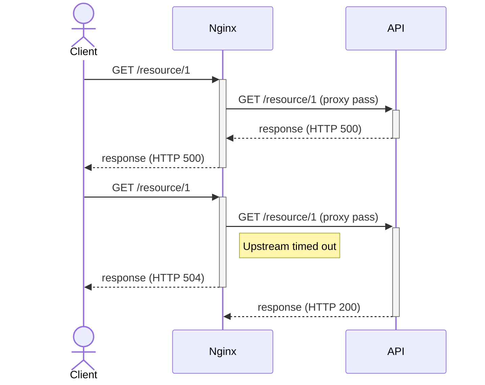
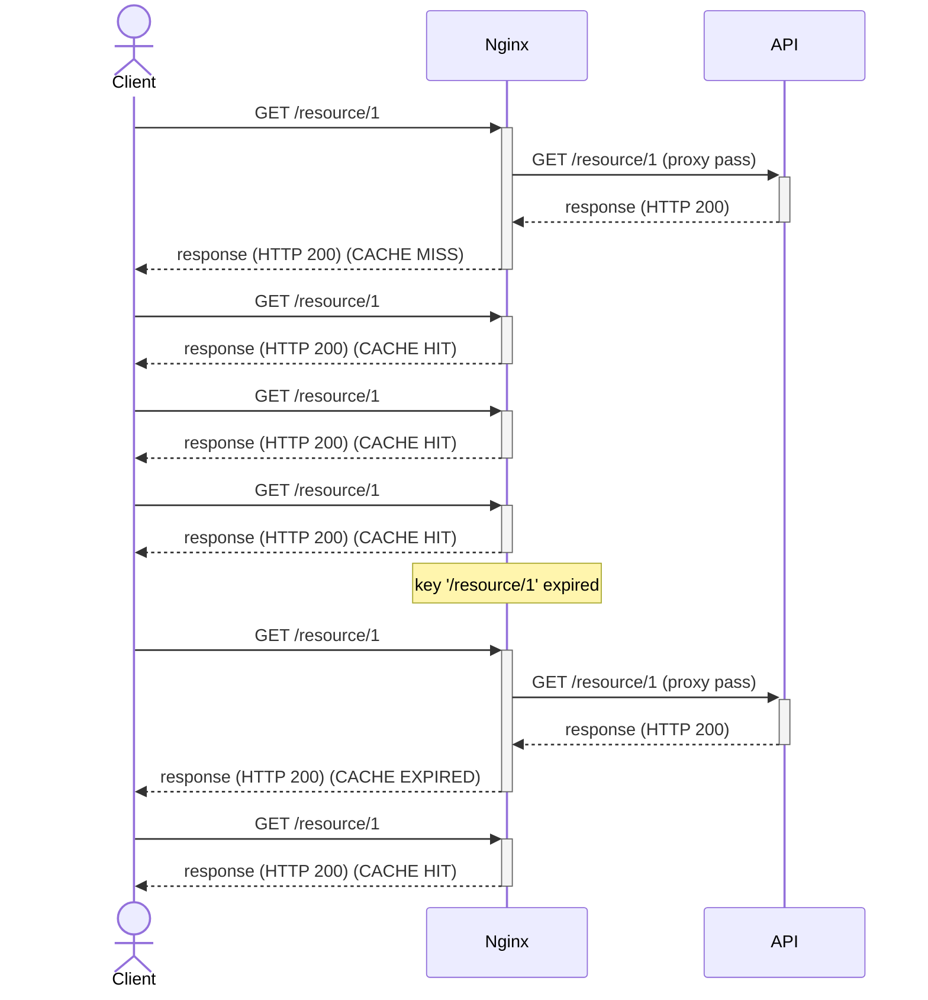
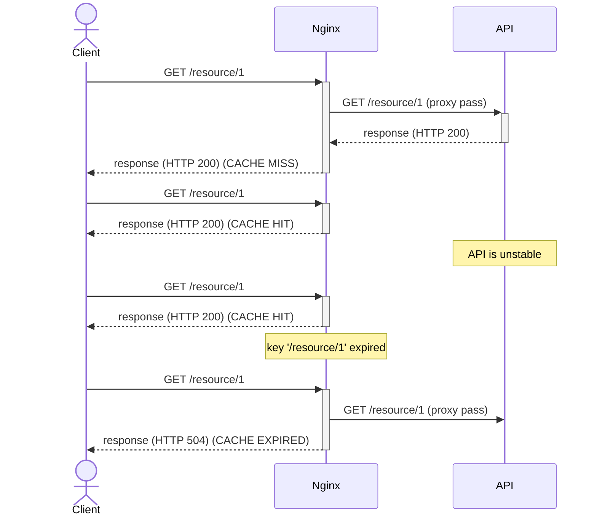
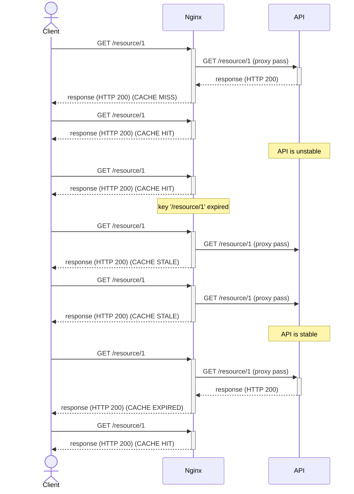

# nginx-cache

This project aims to present some caching strategies for Nginx (or other API gateway). Nginx in this scenario is used as a reverse proxy, receiving the client's requests and proxying them to an upstream (an API in this scenario). The following diagram shows the sequence of events when a client makes a request, considering the client itself, Nginx (API gateway as reverse proxy), and API (upstream).



Nginx is extensively customizable, as well as its cache strategies. Several combinations of parameters can produce a different and valid results for different scenarios. In this project, I'll try to show just a few scenarios and possibilities.

## No cache

Let's take a no-cache setup as a basis. If no statement is included in the Nginx config file to explicitly enable caching, your setup will not cache data, and every single request will be (proxy) passed to the upstream to be resolved. It may not be a problem if your application deals with a few number of requests, and actually, caching doesn't even make sense when handling write-requests (POST, PUT, DELETE, etc). Note in the following diagram, regardless of the HTTP verb or the URI, every single request is (proxy) passed to upstream.



As well as the successful responses, the failed ones will reach the client, I mean, there is no fallback by default.



Finally, let's take a look at the [Nginx config file](nginx/nginx-no-cache.conf).

```
events {}

http {
  log_format main 'Returned ${status} in ${request_time}s, upstream returned ${upstream_status} in ${upstream_response_time}s. Request id: ${request_id}. Response id: ${sent_http_response_id}.';
  
  access_log /dev/stdout main;
  error_log /dev/stderr;

  upstream api {
      server api:3000;
  }

  server {
    listen 8000;

    location / {
        proxy_pass http://api;
        proxy_set_header X-Request-Id $request_id;
        proxy_send_timeout 2s;
        proxy_read_timeout 2s;
    }
  }
}
```

The main points here are (in order):

* Definition of log format and file (in this case, redirecting to standard output)
* Definition of the upstream (just its address in this case)
* Definition of the server with
  * Port to listen to (8000)
  * A location that matches all the paths and the proxy pass definitions.

## Simple cache

If your application must handle more than a few requests, consider using a cache layer at Nginx. This caching layer will temporarily persist the upstream responses and will deliver them to the clients without the need to ask upstream again. The cache data is persisted in the file system, so the first config to add is the path where to store cache files.

```
proxy_cache_path /var/cache keys_zone=zone1:10m
```

Besides the path, `proxy_cache_path` allows us to set [several configurations](http://nginx.org/en/docs/http/ngx_http_proxy_module.html#proxy_cache_path) for, what they call "zone", including its name and the space reserved to store the keys (primary memory). We called our zone `zone1` and reserved 10 MB to store the keys.

By the way, all cached data is indexed by a key, which means, to get a `cache hit` (use the cached data), the key generated by the request must match an already stored key. By default, the key is `$scheme$proxy_host$request_uri`, but we can change it using the directive [proxy_cache_key](http://nginx.org/en/docs/http/ngx_http_proxy_module.html#proxy_cache_key). In this project, I used a custom key (`$uri`) to intentionally ignore query params.

Thinking about the key is a good way to ponder over the cache hit ratio. Usually, the cache is a good solution but believe it: not always. Think how many requests with the same key you pretend to respond to in a time window (which you are willing to deliver outdated data). If this number is too low compared to the total amount of requests at the same time window, maybe you have not-so-cacheable routes. 

Finally, we will activate the cache (using `zone1`) and set the caching time for each key (how much time this cache is valid).

```
proxy_cache zone1;
proxy_cache_valid any 10s;
```

The following diagram shows the consequence of this change. If the cache is empty (cold), the very first request will hit the upstream (CACHE MISS), but the result will be cached, so the next request with the same key will be responded by Nginx with no interaction with the upstream (CACHE HIT).



When the cache expires, the next request to that key will have to hit upstream to get a fresh response (which will be cached). Define cache time carefully: low values reduce the probability to reuse cached data (remember there is a computational cost to keep the cache working) and may not reduce the overload on the upstream; high values may deliver too outdated data to users, i.e. users may take much time to see the new modifications.

## Stale cache

Although [what I called] simple cache strategy improves an app setup for when the cache hit ratio is greater than zero, the real world is evil, and things will fail. Let's see what happens when the API server becomes unavailable for a few seconds.



While the cache key is valid (not expired), the client will not notice the API trouble, since the request doesn't even hit there. But, as soon as the key expires, new requests will try to hit there and won't be able to get a response. This error will be exposed to the client. In some cases, it is totally right, but what if you can deliver the cached data for some extra time while waiting for upstream recovery? This is the stale cache.

Instead of exposing the error to the client, it will deliver the last cached data, but there are several differences from the normal CACHE HIT. First of all, stale means the cache is not valid anymore (it is older than 10s in this case: `proxy_cache_valid any 10s;`), so be careful when configuring a stale cache to not cause side effects due to too outdated data. Let's add a new configuration to `proxy_cache_path` to determine how long a cache key will exist (even expired).

```
proxy_cache_path /var/cache keys_zone=zone1:10m inactive=60m;
```

Also note, different from CACHE HIT, the CACHE STALE means the Nginx tried to reach the upstream (as the cache was expired) and didn't get it. Cache Status "STALE" on the logs, in this case, is worrisome. Fortunately, you can define exactly in what cases you want to deliver stale cache by using [proxy_cache_use_stale](http://nginx.org/en/docs/http/ngx_http_proxy_module.html#proxy_cache_use_stale). By default it is `off`, but let's change to:

```
proxy_cache_use_stale error timeout invalid_header http_500 http_502 http_503 http_504;
```

The following diagram shows an example of how stale cache works.



